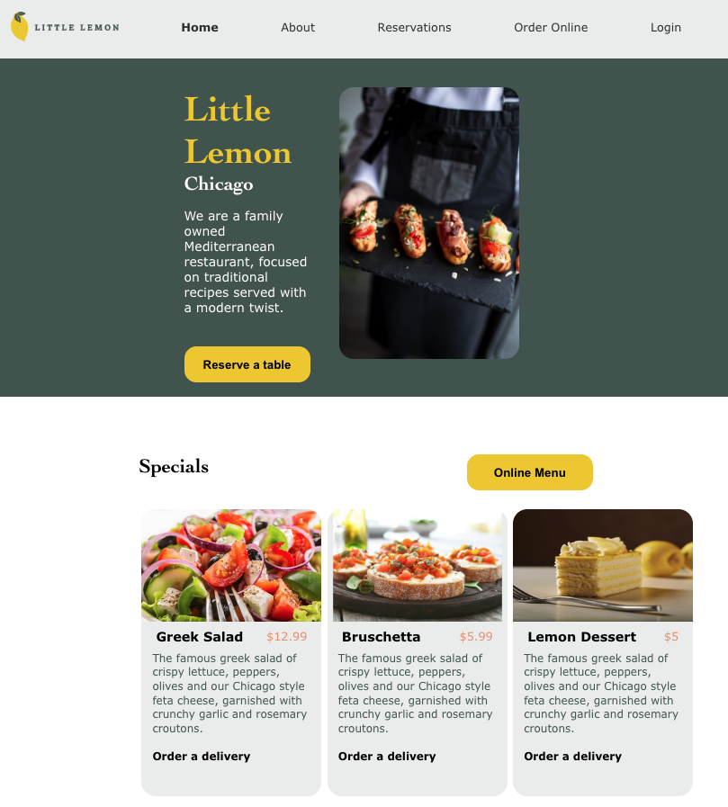
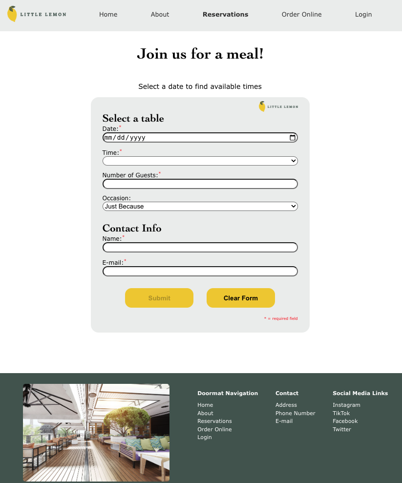

# 🍋 Little Lemon

The homepage for the fictional restaurant Little Lemon.

This is the capstone project for Meta's Front-End Developer certificate course built with React.

&nbsp;

## 💻 Built With
<ul>
  <li>React.js</li>
  <li>Figma</li>
  <li>Styled Components</li>
  <li>Formik</li>
  <li>Jest</li>

